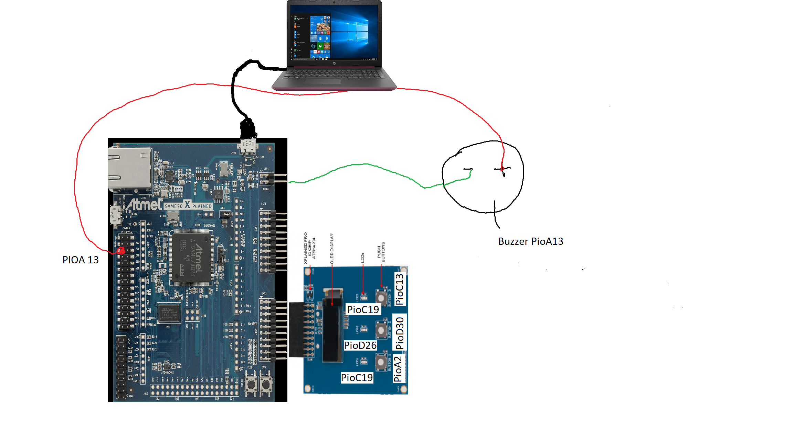

# APS1-Embarcados

As funçoes são:

-main: o main faz com que o led1 piscam de acordo com a música que está sendo selecionada.
 Além disso, o led2 pisca no ritmo da música que está tocando. Por fim, o main possiblita
que toque a música que foi selecionada. ./
-pause: possibilita parar a música e botar play quando quiser.
-sing: toca a música

